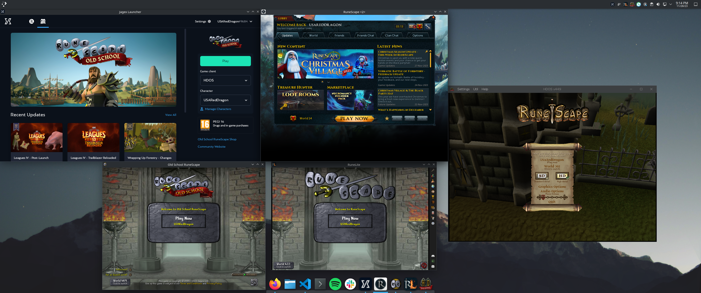

# Jagex Launcher Flatpak

[Click to install](./com.jagex.Launcher.flatpakref){: .btn}

This is a Flatpak package for the Jagex Launcher. It packages the official upstream Wine at the latest version, RuneLite, HDOS, and the Jagex Launcher.

## Screenshots



## Installation

### Installing the Launcher

It is unlikely that Flathub would accept a proprietary application like the Jagex Launcher, paricularly one that is wrapped in Wine. As such, this Flatpak is not available on Flathub.

You can install it by adding the remote and installing it with the following commands:

```bash
flatpak remote-add --user --if-not-exists flathub https://dl.flathub.org/repo/flathub.flatpakrepo
flatpak remote-add --user --if-not-exists JagexLauncher https://jagexlauncher.flatpak.mcswain.dev/JagexLauncher.flatpakrepo
# Required for 32-bit compatibility. Jagex Launcher is 32-bit.
flatpak install --user flathub org.freedesktop.Platform.Compat.i386/x86_64/23.08
flatpak install --user flathub org.freedesktop.Platform.GL32.default/x86_64/23.08
# Install the launcher itself
flatpak install --user JagexLauncher com.jagex.Launcher
# Install RuneLite (if desired)
flatpak install --user JagexLauncher com.jagex.Launcher.ThirdParty.RuneLite
# Install HDOS (if desired)
flatpak install --user JagexLauncher com.jagex.Launcher.ThirdParty.HDOS
```

You can also use the install script which manages the remote and installs the Flatpak, including Nvidia drivers if needed. Note this does NOT install RuneLite or HDOS:

```bash
curl -fSsL https://raw.githubusercontent.com/USA-RedDragon/jagex-launcher-linux-flatpak/main/install.sh | bash
# Install RuneLite (if desired)
flatpak install --user JagexLauncher com.jagex.Launcher.ThirdParty.RuneLite
# Install HDOS (if desired)
flatpak install --user JagexLauncher com.jagex.Launcher.ThirdParty.HDOS
```

### Nvidia GPU Drivers

If you are using the Nvidia proprietary drivers, you will need to install the drivers.

If you're not sure which version of the driver you're on, you can check the `/proc/driver/nvidia/version` file. If it doesn't exists, you're probably using the Nouveau drivers. If it does exist, here is an example of the output:

```bash
$ cat /proc/driver/nvidia/version
NVRM version: NVIDIA UNIX x86_64 Kernel Module  545.29.02  Thu Oct 26 21:21:38 UTC 2023
GCC version:  gcc version 13.2.1 20230801 (GCC)
```

In this case the driver version is `545.29.02`. You can then install the appropriate drivers with the following command, replacing the version with the version you found in the previous step:

```bash
flatpak install --user flathub org.freedesktop.Platform.GL.nvidia-545-29-02/x86_64
flatpak install --user flathub org.freedesktop.Platform.GL32.nvidia-545-29-02/x86_64
```

## Why no Alt1 Toolkit?

The Alt1 Toolkit uses child window rendering that isn't yet supported by Wine. See [this issue](https://bugs.winehq.org/show_bug.cgi?id=45277) for more information.

## Copyrighted Content

This repository contains zero content that is the intellectual property of Jagex.
